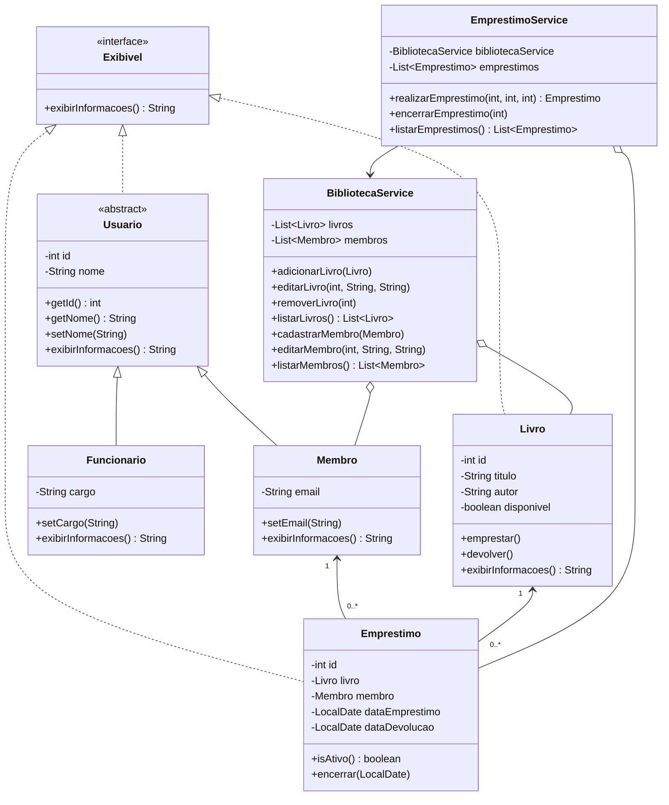

# Sistema de Gerenciamento de Biblioteca

Projeto acadêmico em Java 17 que demonstra gerenciamento de livros, membros e
empréstimos aplicando os principais conceitos de Programação Orientada a Objetos.
Os dados são mantidos em memória e nenhuma biblioteca externa é necessária.

# 1. SSOT da atividade

| ID | Requisito consolidado |
|---|---|
| RF01 | Incluir, editar, remover e listar livros |
| RF02 | Cadastrar, editar e listar membros |
| RF03 | Realizar, encerrar e listar empréstimos |
| RP01 | Representar o domínio por classes adequadas |
| RP02 | Proteger e validar o estado por encapsulamento |
| RP03 | Usar herança entre `Usuario`, `Membro` e `Funcionario` |
| RP04 | Empregar uma classe abstrata com responsabilidade real |
| RP05 | Demonstrar polimorfismo concretamente |
| RP06 | Utilizar uma interface como contrato útil |
| RP07 | Tratar situações anormais com exceções específicas |
| RE01–RE05 | Fornecer diagrama, explicações, comentários, testes e demonstração |

# 2. Prova, guia e criação

## Etapa 1 — Modelo POO fundamental

**Prova:** `Usuario` é abstrata, implementa `Exibivel` e é especializada por
`Membro` e `Funcionario`. As duas subclasses sobrescrevem
`exibirInformacoes()`, permitindo polimorfismo real (RP01, RP03–RP06).

**Guia:** `interfaces/Exibivel.java` define o contrato; `model/Usuario.java`
centraliza ID e nome; `Membro.java` e `Funcionario.java` acrescentam os dados
próprios. `Livro.java` representa o exemplar e protege sua disponibilidade.

**Criação:** os arquivos estão em `src/interfaces` e `src/model`.

**Checkpoint:** código criado, requisitos previstos atendidos e nenhuma
implementação da etapa ficou pendente.

## Etapa 2 — Livros e membros

**Prova:** `BibliotecaService` fornece `adicionarLivro`, `editarLivro`,
`removerLivro`, `listarLivros`, `cadastrarMembro`, `editarMembro` e
`listarMembros` (RF01 e RF02). IDs duplicados e buscas inválidas são tratados.

**Guia:** o serviço mantém coleções privadas em memória e devolve cópias não
modificáveis. A edição preserva o ID e não altera a disponibilidade do livro.

**Criação:** implementação em `src/service/BibliotecaService.java`.

**Checkpoint:** CRUD solicitado criado e integrado ao modelo.

## Etapa 3 — Empréstimos e regras de negócio

**Prova:** `EmprestimoService` realiza, encerra e lista empréstimos (RF03),
relacionando `Livro` e `Membro`. A realização indisponibiliza o livro; a
devolução registra a data e o disponibiliza novamente. Exceções representam
falhas do domínio (RP07).

**Guia:** `Emprestimo` preserva o histórico; empréstimo ativo é aquele cuja
`dataDevolucao` é nula. O serviço rejeita IDs repetidos, livro indisponível,
devolução repetida e referências inexistentes.

**Criação:** implementação em `src/model/Emprestimo.java`,
`src/service/EmprestimoService.java` e `src/exception`.

**Checkpoint:** regras de estado e tratamento de erros concluídos.

## Etapa 4 — Integração e demonstração

**Prova:** `Main` executa cadastro, edição, remoção, listagens, empréstimo,
erro por indisponibilidade e devolução. Uma `List<Usuario>` contendo tipos
concretos diferentes evidencia o polimorfismo.

**Guia e criação:** `src/app/Main.java` funciona como roteiro de apresentação
do projeto e trata a falha esperada sem interromper a demonstração.

**Checkpoint:** todas as funcionalidades estão visíveis em uma única execução.

## Etapa 5 — Testes e validação

**Prova:** `BibliotecaTest` cobre operações válidas, listagens, disponibilidade,
devolução, remoção de livro emprestado e todas as buscas inválidas.

**Guia e criação:** o runner usa asserções próprias para evitar JUnit ou qualquer
dependência externa e encerra imediatamente caso um cenário falhe.

**Checkpoint:** os cenários obrigatórios possuem verificações automatizadas.

## Etapa 6 — Diagrama e documentação

### Diagrama de classes



### Explicação do projeto e da POO

- `Livro`, `Membro` e `Emprestimo` representam as entidades principais;
  `BibliotecaService` e `EmprestimoService` coordenam os casos de uso.
- O encapsulamento aparece nos atributos privados e nos métodos que validam ou
  protegem alterações. A disponibilidade não possui setter público arbitrário.
- A abstração está em `Usuario`, que reúne o estado comum sem representar um
  usuário genérico instanciável.
- A herança liga `Membro` e `Funcionario` a `Usuario`.
- O polimorfismo é demonstrado em `Main` ao percorrer diferentes subclasses
  como `Usuario` e também no método genérico que recebe objetos `Exibivel`.
- `Exibivel` é um contrato usado por usuários, livros e empréstimos.
- As exceções em `exception` informam precisamente entidades ausentes,
  indisponibilidade e operações incompatíveis com o estado atual.

### Matriz de rastreabilidade

| ID | Requisito | Evidência no projeto | Status |
|---|---|---|---|
| RF01 | Gerenciar livros | `BibliotecaService` e testes | ✅ |
| RF02 | Gerenciar membros | `BibliotecaService` e testes | ✅ |
| RF03 | Gerenciar empréstimos | `EmprestimoService` e testes | ✅ |
| RP01 | Classes de domínio | Pacote `model` | ✅ |
| RP02 | Encapsulamento | Atributos privados e métodos validados | ✅ |
| RP03 | Herança | `Usuario` → `Membro`/`Funcionario` | ✅ |
| RP04 | Abstração | `Usuario` abstrato | ✅ |
| RP05 | Polimorfismo | `Main` e sobrescritas | ✅ |
| RP06 | Interface | `Exibivel` implementada e consumida | ✅ |
| RP07 | Exceções | Pacote `exception` e testes de erro | ✅ |
| RE01 | Diagrama | Diagrama Mermaid neste documento | ✅ |
| RE02 | Explicação | Seção “Explicação do projeto e da POO” | ✅ |
| RE03 | Comentários úteis | Regras importantes comentadas no código | ✅ |
| RE04 | Testes | `BibliotecaTest` | ✅ |
| RE05 | Demonstração | `Main` | ✅ |

**Checkpoint final:** código, testes, diagrama, explicações e rastreabilidade
foram produzidos com a mesma arquitetura e nomenclatura.

# 3. Compilação e execução

Com o JDK 17 instalado, execute no PowerShell a partir da raiz do projeto:

```powershell
$arquivosJava = Get-ChildItem -Recurse -Filter *.java src
javac -encoding UTF-8 -d out $arquivosJava.FullName
java -cp out app.Main
java -cp out test.BibliotecaTest
```

Resultado esperado dos testes: `Todos os 14 testes passaram.`
